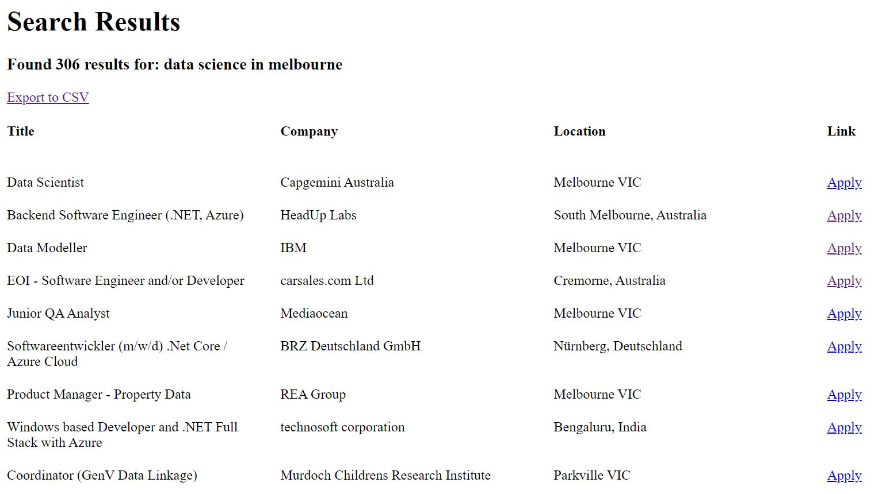

# JobSearch-Web-Scrapper

Simple Python Web Scrapper for job searching on multiple sites (indeed, stackoverflow for now) at once.

Lets you save the scrapped jobs as a .csv.

Go to https://repl.it/@GyuHwanHwan/SuperScrapper-using-Flask to run this program straight away.

Homepage looks like this:

Search page looks like this:

